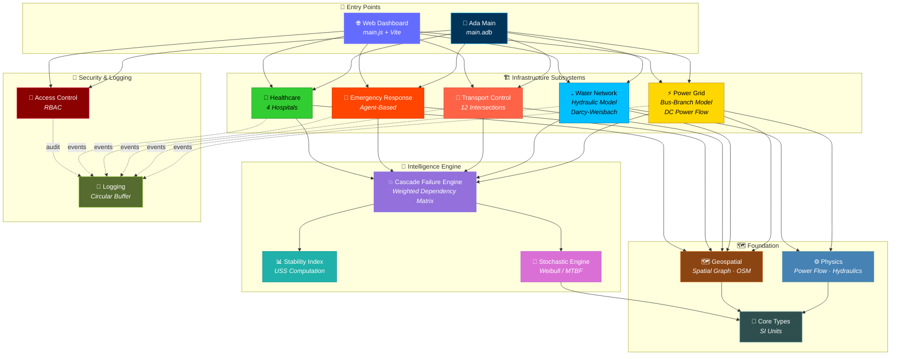
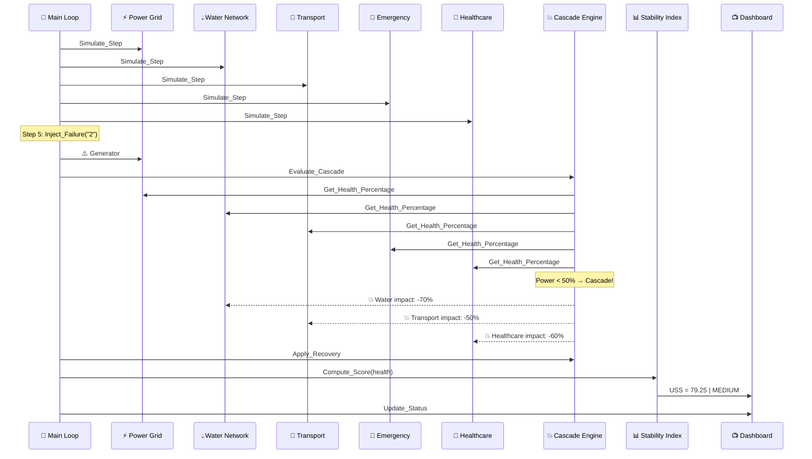
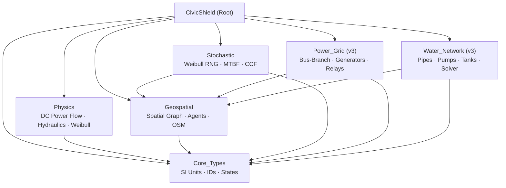
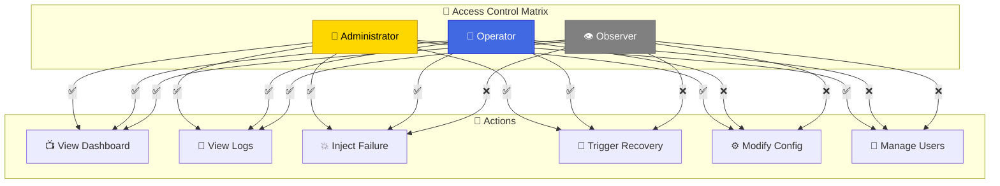

```mermaid
gantt
    title CivicShield Simulation Timeline (20 Steps)
    dateFormat X
    axisFormat Step %s

    section System Status
    Initialization              :done, 0, 1
    Normal Operation            :active, 1, 5

    section Failures
    ⚡ Generator #2 Offline     :crit, 5, 6
    💧 Water Pump #3 Burst      :crit, 8, 9
    🚥 Intersection #5 Incident :crit, 10, 11

    section Recovery
    Cascade Evaluation          :active, 5, 20
    Power Recovery              :active, 6, 20
    System Stabilization        :active, 11, 20
```

<p align="center">
  
</p>

<p align="center">
  
</p>

<p align="center">
  <strong>🏙️ High-Integrity Urban Infrastructure Digital Twin</strong><br>
  <em>Physics-Driven · Fault-Tolerant · Real-Time Web Dashboard · Academically Rigorous</em>
</p>

<p align="center">
  
  
  
  
  
  
</p>

<p align="center">
  
  
  
  
  
</p>

---

## 👨‍💻 Developer

<p align="center">
  
</p>

<p align="center">
  <strong>ABDESSAMAD BOURKIBATE</strong><br>
  <em>Systems Engineer · Software Architect · Infrastructure Security Researcher</em>
</p>

---

## 📋 Table of Contents

- [1. Abstract](#1-abstract)
- [2. Problem Statement](#2-problem-statement)
- [3. System Architecture](#3-system-architecture)
- [4. Web Dashboard](#4-web-dashboard)
- [5. Module Specifications](#5-module-specifications)
- [6. Physics-Driven Digital Twin (v3.0)](#6-physics-driven-digital-twin-v30)
- [7. Cascade Failure Model](#7-cascade-failure-model)
- [8. Urban Stability Score (USS)](#8-urban-stability-score-uss)
- [9. Concurrency Model](#9-concurrency-model)
- [10. Security Architecture](#10-security-architecture)
- [11. Build & Execution](#11-build--execution)
- [12. Simulation Output](#12-simulation-output)
- [13. Project Structure](#13-project-structure)
- [14. Academic References](#14-academic-references)
- [15. License](#15-license)

---

## 1. Abstract

> **CivicShield** is a high-integrity, fault-tolerant **Digital Twin** for critical urban infrastructure, engineered in **Ada 2012** (core simulation engine) with a **premium real-time Web Dashboard** (JavaScript/Vite). It models five interdependent subsystems — **Power Grids**, **Water Distribution Networks**, **Traffic Control Systems**, **Emergency Response Units**, and **Healthcare Facilities** — with cascading failure propagation, physics-based modeling, stochastic failure analysis, and real-time visual monitoring.

The project operates on two tiers:

| Tier | Technology | Purpose |
|------|-----------|---------|
| **🧠 Core Engine** | Ada 2012 | Physics-based subsystem modeling, Weibull reliability, geospatial graph |
| **📺 Web Dashboard** | JavaScript + Vite | Real-time glassmorphism UI, live USS gauge, event log, simulation controls |

The simulator employs Ada's **protected types** for thread-safe shared state, **strong SI-unit typing** for compile-time correctness, and **Weibull failure distributions** for industrial-grade reliability modeling. A **premium web dashboard** provides real-time visualization with glassmorphism design, animated USS gauge, subsystem health panels, and role-gated simulation controls.

---

## 2. Problem Statement

Modern urban infrastructure consists of deeply interconnected systems where failure in one subsystem can cascade across boundaries:

| 🔴 Failure Scenario | 🌊 Cascading Impact |
|---------------------|---------------------|
| ⚡ Power grid blackout | 💧 Water pumps stop → 🚥 Traffic signals fail → 🏥 Hospitals on backup |
| 💧 Water main burst | 🏥 Hospital sterilization compromised → 🚨 Emergency response diverted |
| 🚥 Traffic gridlock | 🚨 Emergency units delayed → 🏥 Patient mortality increases |
| 🚨 Emergency saturation | 🏥 Untreated patients → ⚡ Power stations unmaintained |

**CivicShield** provides a deterministic, physics-driven environment to study, visualize, and mitigate these cascading risks before they manifest in real-world infrastructure.

---

## 3. System Architecture

### 3.1 High-Level Architecture



### 3.2 Data Flow Architecture



---

## 4. Web Dashboard

CivicShield includes a **premium real-time web dashboard** built with Vite and vanilla JavaScript, featuring a glassmorphism dark-theme design.

### 4.1 Features

| Feature | Description |
|---------|-------------|
| 🔐 **Login Page** | Glassmorphism design with animated particles, credential hints, role-based access |
| 📊 **USS Gauge** | Real-time SVG gauge with animated threat-level color transitions |
| 📈 **USS History Chart** | Canvas-rendered line chart tracking USS over all simulation steps |
| ⚡ **Subsystem Panels** | 5 live panels with health bars, component chips, and detailed metrics |
| 📝 **Event Log** | Filterable real-time log with severity icons and color-coded entries |
| 💥 **Cascade Status** | Active cascade count and recovery action tracker |
| 🎮 **Simulation Controls** | Start, Pause, Resume, Step, Reset, Speed slider (0.5x – 5x) |
| 💥 **Manual Actions** | Role-gated failure injection and recovery trigger buttons |
| 📊 **Final Report** | Modal with subsystem breakdown, cascade history, and summary |

### 4.2 Running the Dashboard

```bash
cd CivicShield
npm install
npm run dev
# → opens at http://localhost:5173
```

### 4.3 Design System

| Element | Style |
|---------|-------|
| Theme | Dark glassmorphism (blur + transparency) |
| Fonts | Inter (UI) + JetBrains Mono (data) |
| Colors | 🟢 Green=Normal, 🟡 Yellow=Warning, 🟠 Orange=High, 🔴 Red=Critical |
| Layout | 3-column: Controls + Subsystems + Logs |
| Animations | Pulse gauges, slide-in logs, glow-on-critical |

---

## 5. Module Specifications

### 5.1 ⚡ Power Grid (`power_grid.ads / .adb`)

| Property | Value |
|----------|-------|
| **Components** | 5 Generators, 8 Substations |
| **Capacity** | 200 MW per generator (1000 MW total) |
| **Concurrency** | Protected type `Grid_State` |
| **Failure Mode** | Generator offline → load redistribution |
| **Health Formula** | `(online_capacity / total_capacity) × 100` |

```ada
--  Public API
procedure Initialize;
procedure Simulate_Step;
procedure Inject_Failure (Component : in String);
function  Get_Status return Grid_Status_Type;
function  Get_Health_Percentage return Float;
```

**Status Thresholds:**
| Health % | Status | Icon |
|----------|--------|------|
| ≥ 80% | `Normal` | 🟢 |
| ≥ 50% | `Warning` | 🟡 |
| ≥ 20% | `Critical` | 🟠 |
| < 20% | `Offline` | 🔴 |

---

### 5.2 💧 Water Network (`water_network.ads / .adb`)

| Property | Value |
|----------|-------|
| **Components** | 6 Pumps, 3 Reservoirs, 10 Pipelines |
| **Reservoir Capacity** | 1,000,000 L each |
| **Concurrency** | Protected type `Network_State` |
| **Failure Mode** | Pump failure → pressure drop → rerouting |
| **Health Formula** | `pump_uptime × 0.6 + reservoir_level × 0.4` |

---

### 5.3 🚥 Transport Control (`transport_control.ads / .adb`)

| Property | Value |
|----------|-------|
| **Components** | 12 Intersections with signal phases |
| **Signal Phases** | Green → Yellow → Red → (Flashing on failure) |
| **Congestion Range** | 0.0 (empty) to 100.0 (gridlock) |
| **Propagation** | High congestion spills 30% to adjacent intersections |
| **Health Formula** | `(100 - avg_congestion) × 0.6 + operational% × 0.4` |

---

### 5.4 🚨 Emergency Response (`emergency_response.ads / .adb`)

| Property | Value |
|----------|-------|
| **Fleet** | 4 🚒 Fire + 6 🚓 Police + 5 🚑 Medical = 15 units |
| **Dispatch** | Priority-based, nearest available unit |
| **Return Rate** | 30% chance per step of returning from deployment |
| **Health Formula** | `operational% × 0.5 + available% × 0.5` |

**Priority Levels:**
| Priority | Response | Icon |
|----------|----------|------|
| `Emergency` | Immediate | 🔴 |
| `High` | < 5 min | 🟠 |
| `Medium` | < 15 min | 🟡 |
| `Low` | Queued | 🟢 |

---

### 5.5 🏥 Healthcare (`healthcare.ads / .adb`)

| Hospital | Beds | ICU | Surge |
|----------|------|-----|-------|
| General Hospital Alpha | 200 | 30 | +50 |
| City Medical Center | 150 | 20 | +30 |
| Regional Hospital Beta | 300 | 40 | +60 |
| Community Health Clinic | 100 | 15 | +20 |
| **Total** | **750** | **105** | **+160** |

**Surge Activation:** Automatically activates when bed occupancy exceeds 90%.

---

### 5.6 💥 Cascade Failure Engine (`cascade_failure.ads / .adb`)

The core intelligence module that models inter-subsystem dependencies.

```ada
procedure Evaluate_Cascade;   --  Analyze all subsystem health
procedure Apply_Recovery;     --  Execute priority-based recovery
function  Get_Impact_Report return Impact_Report;
```

---

### 5.7 📊 Stability Index (`stability_index.ads / .adb`)

Computes the **Urban Stability Score (USS)** — a single composite metric.

---

### 5.8 🔑 Access Control (`access_control.ads / .adb`)

Role-based access control with three privilege tiers.

---

### 5.9 📝 Logging (`logging.ads / .adb`)

Centralized, thread-safe event logging with circular buffer (500 entries).

---

## 6. Physics-Driven Digital Twin (v3.0)

> ⚡ **CivicShield v3.0** introduces a complete architectural overhaul from percentage-based simulation to physics-driven Digital Twin modeling using real engineering mathematics.

### 6.1 New Foundation Packages



### 6.2 Strong Physical Typing (`Core_Types`)

Every physical quantity is a **named Ada type** — mixing units is a compile-time error:

```ada
type Megawatts              is new Long_Float range 0.0 .. 100_000.0;
type Kilovolts              is new Long_Float range 0.0 .. 1_200.0;
type Hertz                  is new Long_Float range 0.0 .. 100.0;
type Pascals                is new Long_Float range 0.0 .. 100_000_000.0;
type Cubic_Meters_Per_Second is new Long_Float range 0.0 .. 10_000.0;
type Probability            is new Long_Float range 0.0 .. 1.0;
type MTBF_Hours             is new Long_Float range 0.0 .. Long_Float'Last;
```

### 6.3 Physics Engine (`Physics`)

| Domain | Computation | Formula |
|--------|------------|---------|
| **Electrical** | DC Power Flow | `P_ij = (θ_i − θ_j) / X_ij` |
| **Electrical** | Frequency Deviation | `Δf = −(ΔP / (2·H·S_base)) · f₀` |
| **Electrical** | Line Losses | `P_loss = I² · R` |
| **Hydraulic** | Darcy-Weisbach Head Loss | `h_f = f · (L/D) · (V²/2g)` |
| **Hydraulic** | Hazen-Williams | `h_f = 10.67·Q^1.852 / (C^1.852·D^4.8704)·L` |
| **Hydraulic** | Pump Power | `P = ρ·g·Q·H / η` |
| **Reliability** | Weibull CDF | `F(t) = 1 − exp(−(t/η)^β)` |
| **Reliability** | Weibull Hazard | `λ(t) = (β/η)·(t/η)^(β−1)` |
| **Reliability** | MTBF | `η · Γ(1 + 1/β)` |

### 6.4 Physics-Based Power Grid (v3)

| Component | Old Model | New Physics Model |
|-----------|-----------|-------------------|
| Generator | On/Off + health % | Rated MW, ramp rate, inertia H, droop %, Weibull reliability |
| Bus | Not modeled | Voltage (kV), angle (rad), ZIP load (Z+I+P), net injection |
| Line | Not modeled | Impedance (R+jX p.u.), thermal limit (MW), loading % |
| Protection | Not modeled | Overcurrent, under-frequency, over-voltage relays |
| Dispatch | Not modeled | Economic dispatch minimizing fuel cost |

### 6.5 Physics-Based Water Network (v3)

| Component | Old Model | New Physics Model |
|-----------|-----------|-------------------|
| Pipe | Health % | Length, diameter, roughness (ε), HW coefficient, head loss |
| Pump | On/Off | Characteristic curve (H vs Q), VFD speed, power draw P=ρgQH/η |
| Tank | Level % | Cylindrical geometry, min/max level, mass balance (dV/dt) |
| Junction | Not modeled | Elevation, base demand, diurnal pattern, pressure (bar) |
| Solver | Not modeled | Global Gradient Algorithm (Newton-Raphson) |

### 6.6 Stochastic Failure Engine

| Feature | Description |
|---------|-------------|
| **Weibull Failures** | β<1 infant mortality, β=1 random, β>1 wear-out |
| **Decision Logic** | `P(fail in Δt | survived to t) ≈ λ(t)·Δt` vs random draw |
| **Repair Times** | Log-normal distribution with mean/std-dev |
| **Common-Cause** | β-factor model with geospatial radius (earthquake, flood) |
| **Monte Carlo** | Pre-sample failure times via inverse Weibull into priority queue |
| **RNG** | Xoshiro256** (period 2²⁵⁶ − 1) |

### 6.7 Geospatial Foundation

| Feature | Description |
|---------|-------------|
| **Graph Model** | Directed G = (V, E) with WGS-84 coordinates |
| **Infrastructure Layers** | Power, Water, Gas, Road, Rail, Telecom |
| **OSM Integration** | Nodes/edges map to OSM node IDs and way IDs |
| **Agent Model** | Emergency vehicles with position, speed, heading on edges |
| **Pathfinding** | Dijkstra/A* on weighted spatial graph |
| **Distance** | Haversine great-circle computation |

---

## 7. Cascade Failure Model

### 7.1 Dependency Matrix

<p align="center">
  
</p>


| Source ⚡ | Target 🎯 | Weight | Rationale |
|-----------|-----------|--------|-----------|
| ⚡ Power | 💧 Water | **0.70** | Electric pumps and treatment plants require power |
| ⚡ Power | 🚥 Transport | **0.50** | Traffic signals are electrically powered |
| ⚡ Power | 🏥 Healthcare | **0.60** | Hospitals depend on continuous power supply |
| 💧 Water | 🏥 Healthcare | **0.40** | Hospitals need clean water for operations |
| 🚥 Transport | 🚨 Emergency | **0.50** | Emergency vehicles require passable roads |

### 7.2 Cascade Threshold

A cascade is triggered when any subsystem's health drops below **50%**:

```
IF health(subsystem) < 50% THEN
   degradation = (50 - health) × dependency_weight
   FOR each dependent subsystem:
      apply degradation
   END FOR
END IF
```

### 7.3 Recovery Priority

| Priority | Subsystem | Recovery Rate | Rationale |
|----------|-----------|--------------|-----------| 
| 🥇 1st | ⚡ Power | -10%/step | Highest cascade multiplier |
| 🥈 2nd | 💧 Water | -8%/step | Critical for healthcare |
| 🥉 3rd | 🚥 Transport | -5%/step | Enables emergency access |
| 4th | 🚨 Emergency | -5%/step | Depends on transport |
| 5th | 🏥 Healthcare | -5%/step | End-user impact |

---

## 8. Urban Stability Score (USS)

### 8.1 Computation Formula

```
USS = Σ (weight_i × health_i)  for i ∈ {Power, Water, Transport, Emergency, Healthcare}
```

| Subsystem | Weight | Justification |
|-----------|--------|---------------|
| ⚡ Power | **0.30** | Highest cascade impact on all other systems |
| 💧 Water | **0.25** | Essential for healthcare and public health |
| 🏥 Healthcare | **0.20** | Direct impact on population wellbeing |
| 🚨 Emergency | **0.15** | Response capability determines crisis resilience |
| 🚥 Transport | **0.10** | Indirect enabler for other services |

### 8.2 Threat Level Classification

| USS Range | Threat Level | Color | Description |
|-----------|-------------|-------|-------------|
| ≥ 80.0 | 🟢 `LOW` | Green | All systems nominal |
| ≥ 60.0 | 🟡 `MEDIUM` | Yellow | Degraded performance |
| ≥ 30.0 | 🟠 `HIGH` | Orange | Multiple subsystem failures |
| < 30.0 | 🔴 `CRITICAL` | Red | Systemic collapse imminent |

---

## 9. Concurrency Model

CivicShield uses **Ada Protected Objects** — a language-level concurrency primitive that guarantees:

| Property | Guarantee |
|----------|-----------|
| **Mutual Exclusion** | Only one task can execute a protected procedure at a time |
| **Data Integrity** | No race conditions by construction |
| **Read Concurrency** | Multiple tasks can read via protected functions simultaneously |
| **Determinism** | Same inputs produce same outputs across runs |

```ada
--  Example: Power Grid Protected State
protected Grid_State is
   procedure Fail_Generator (Id : Generator_Id);  -- Exclusive write
   procedure Update_Status;                        -- Exclusive write
   function  Get_Status return Grid_Status_Type;   -- Concurrent read
   function  Get_Health return Float;              -- Concurrent read
private
   Generators : Generator_Array;
   Status     : Grid_Status_Type := Normal;
   Health_Pct : Float := 100.0;
end Grid_State;
```

---

## 10. Security Architecture

### 10.1 Role-Based Access Control (RBAC)



### 10.2 Default Credentials (Simulation)

| Username | Password | Role | Permissions |
|----------|----------|------|-------------|
| `admin` | `shield2026` | 👑 Administrator | Full access |
| `operator` | `ops2026` | 🔧 Operator | Operations |
| `observer` | `view2026` | 👁️ Observer | Read-only |

---

## 11. Build & Execution

### 11.1 Ada Engine Prerequisites

| Requirement | Version | Purpose |
|-------------|---------|---------|
| **GNAT** | ≥ 15.x | Ada 2012 compiler |
| **gprbuild** | ≥ 25.x | Project build system |
| **Alire** | ≥ 2.x | Package manager (optional) |

### 11.2 Web Dashboard Prerequisites

| Requirement | Version | Purpose |
|-------------|---------|---------|
| **Node.js** | ≥ 18.x | JavaScript runtime |
| **npm** | ≥ 9.x | Package manager |

### 11.3 Installation (Windows)

```powershell
# Install Ada toolchain
winget install AdaLang.Alire.Portable
alr toolchain --select gnat_native gprbuild

# Install Node.js (for web dashboard)
winget install OpenJS.NodeJS
```

### 11.4 Build & Run

```bash
# Clone the repository
git clone https://github.com/ABDESSAMAD-BOURKIBATE/CivicShield.git
cd CivicShield

# === Ada Engine ===
gprbuild -P civicshield.gpr -p
./bin/civicshield          # Linux/macOS
.\bin\civicshield.exe      # Windows

# === Web Dashboard ===
npm install
npm run dev                # → http://localhost:5173

# Build for production
npm run build
npm run preview
```

---

## 12. Simulation Output

### 12.1 Web Dashboard

The web dashboard provides a premium glassmorphism interface with:
- **Left Sidebar:** USS gauge (SVG), simulation controls, manual actions
- **Center:** 5 subsystem panels with health bars and component chips, USS history chart
- **Right Sidebar:** Filterable event log, cascade status panel
- **Modal:** Final stability report with subsystem breakdown

### 12.2 Console Dashboard

```
+----------------------------------------------------+
|           SYSTEM STATUS DASHBOARD                  |
+----------------------------------------------------+
| POWER GRID    : [########--]  NORMAL               |
| WATER NETWORK : [########--]  NORMAL               |
| TRANSPORT     : [#########-]  NORMAL               |
| EMERGENCY     : [##########]  NORMAL               |
| HEALTHCARE    : [#####-----]  WARNING              |
+----------------------------------------------------+
| USS: 79.25  |  THREAT: MEDIUM  [YELLOW]            |
+----------------------------------------------------+
```

### 12.3 Event Log Sample

```
[Step 0] ACCESS_CTRL | INFO    | User authenticated: operator
[Step 0] POWER       | INFO    | Power Grid initialized: 5 generators online
[Step 5] POWER       | ERROR   | FAILURE INJECTED: Generator 2 taken offline
[Step 5] EMERGENCY   | INFO    | FIRE unit dispatched to Power Station Alpha
[Step 8] WATER       | ERROR   | FAILURE INJECTED: Pump 3 burst simulated
[Step 8] CASCADE     | WARNING | Power degradation affecting Water Network
[Step 10] TRANSPORT  | ERROR   | INCIDENT: Intersection 5 disabled
[Step 10] HEALTHCARE | INFO    | Patient admitted (Severity: CRITICAL)
```

### 12.4 Scripted Failure Timeline



---

## 13. Project Structure

```
CivicShield/
│
├── 📄 civicshield.gpr              ← GNAT project file
├── 📄 package.json                 ← Node.js / Vite configuration
├── 📄 vite.config.js               ← Vite build configuration
├── 📄 index.html                   ← Web dashboard entry point
├── 📄 main.js                      ← JavaScript entry point
├── 📄 style.css                    ← Premium glassmorphism stylesheet
├── 📄 README.md                    ← This document
│
├── 📂 src/
│   │
│   │── 🚀 main.adb                 ← Ada entry point + simulation loop
│   │
│   │── ⚡ power_grid.ads / .adb    ← Power grid (legacy)
│   │── 💧 water_network.ads / .adb ← Water network (legacy)
│   │── 🚥 transport_control.ads / .adb ← Transport
│   │── 🚨 emergency_response.ads / .adb ← Emergency
│   │── 🏥 healthcare.ads / .adb    ← Healthcare
│   │── 💥 cascade_failure.ads / .adb ← Cascade engine
│   │── 📊 stability_index.ads / .adb ← USS
│   │── 🔑 access_control.ads / .adb ← RBAC
│   │── 📝 logging.ads / .adb       ← Logging
│   │── 📺 gui.ads / .adb           ← Console dashboard
│   │
│   │── ── v3.0 Digital Twin Specifications ──
│   │── 📐 civicshield.ads          ← Root package (namespace)
│   │── 📐 civicshield-core_types.ads ← SI units, identifiers, states
│   │── ⚙️ civicshield-physics.ads   ← Power flow, hydraulics, Weibull math
│   │── 🗺️ civicshield-geospatial.ads ← Spatial graph, agents, OSM
│   │── ⚡ civicshield-power_grid.ads ← Bus-branch, generators, relays
│   │── 💧 civicshield-water_network.ads ← Pipes, pumps, tanks, solver
│   │── 🎲 civicshield-stochastic.ads ← Weibull RNG, MTBF, CCF
│   │
│   ├── 📂 engine/                   ← JavaScript simulation modules
│   │   ├── powerGrid.js
│   │   ├── waterNetwork.js
│   │   ├── transportControl.js
│   │   ├── emergencyResponse.js
│   │   ├── healthcare.js
│   │   ├── cascadeFailure.js
│   │   ├── stabilityIndex.js
│   │   ├── accessControl.js
│   │   ├── logging.js
│   │   └── simulation.js           ← Orchestrator (20-step loop)
│   │
│   └── 📂 ui/                      ← JavaScript UI components
│       ├── loginPage.js             ← Glassmorphism login
│       └── dashboard.js             ← Real-time monitoring dashboard
│
└── 📂 assets/                       ← Images and diagrams
```

**Statistics:**
| Metric | Value |
|--------|-------|
| Total Files | 40+ |
| Ada Specifications (`.ads`) | 17 |
| Ada Bodies (`.adb`) | 11 |
| JavaScript Modules | 12 |
| CSS Stylesheet | 1 (29 KB) |
| Ada Source Size | ~130 KB |
| JavaScript Source Size | ~45 KB |
| Technology Stack | Ada 2012 + JavaScript ES2022 + Vite |

---

## 14. Academic References

This simulator's design is informed by the following research domains:

1. **Urban Infrastructure Interdependency Modeling**
   - Rinaldi, S.M., Peerenboom, J.P., & Kelly, T.K. (2001). *Identifying, Understanding, and Analyzing Critical Infrastructure Interdependencies.* IEEE Control Systems Magazine

2. **Cascading Failure Analysis**
   - Buldyrev, S.V., et al. (2010). *Catastrophic Cascade of Failures in Interdependent Networks.* Nature, 464

3. **High-Integrity Software Engineering**
   - Barnes, J. (2014). *Programming in Ada 2012.* Cambridge University Press

4. **Concurrent Real-Time Systems**
   - Burns, A., & Wellings, A. (2007). *Concurrent and Real-Time Programming in Ada.* Cambridge University Press

5. **Infrastructure Resilience Metrics**
   - Bruneau, M., et al. (2003). *A Framework to Quantitatively Assess and Enhance the Seismic Resilience of Communities.* EERI

6. **Reliability Engineering**
   - Abernethy, R.B. (2006). *The New Weibull Handbook.* Reliability Analysis Center

7. **Hydraulic Network Analysis**
   - Todini, E. & Pilati, S. (1988). *A Gradient Algorithm for the Analysis of Pipe Networks.* Computer Applications in Water Supply

8. **Power System Analysis**
   - Glover, J.D., Sarma, M.S., & Overbye, T.J. (2017). *Power Systems Analysis and Design.* Cengage Learning

---

## 15. License

```
MIT License

Copyright (c) 2026 ABDESSAMAD BOURKIBATE

Permission is hereby granted, free of charge, to any person obtaining a copy
of this software and associated documentation files (the "Software"), to deal
in the Software without restriction, including without limitation the rights
to use, copy, modify, merge, publish, distribute, sublicense, and/or sell
copies of the Software, and to permit persons to whom the Software is
furnished to do so, subject to the following conditions:

The above copyright notice and this permission notice shall be included in all
copies or substantial portions of the Software.
```

---

<p align="center">
  
  
</p>

<p align="center">
  <strong>🛡️ CivicShield — Protecting Infrastructure Through Physics-Driven Simulation</strong>
</p>
