<p align="center">
  
</p>

<p align="center">
  
</p>

<p align="center">
  <strong>🏛️ High-Integrity Urban Infrastructure Simulation Engine</strong><br>
  <em>Fault-Tolerant · Concurrent · Deterministic · Academically Rigorous</em>
</p>

<p align="center">
  
  
  
  
  
  
</p>

<p align="center">
  
  
  
  
  
</p>

---

## 👨‍💻 Developer

<p align="center">
  
</p>

<p align="center">
  <strong>ABDESSAMAD BOURKIBATE</strong><br>
  <em>Systems Engineer · Software Architect · Infrastructure Security Researcher</em>
</p>

---

## 📋 Table of Contents

- [1. Abstract](#1-abstract)
- [2. Problem Statement](#2-problem-statement)
- [3. System Architecture](#3-system-architecture)
- [4. Module Specifications](#4-module-specifications)
- [5. Cascade Failure Model](#5-cascade-failure-model)
- [6. Urban Stability Score (USS)](#6-urban-stability-score-uss)
- [7. Concurrency Model](#7-concurrency-model)
- [8. Security Architecture](#8-security-architecture)
- [9. Build & Execution](#9-build--execution)
- [10. Simulation Output](#10-simulation-output)
- [11. Project Structure](#11-project-structure)
- [12. Academic References](#12-academic-references)
- [13. License](#13-license)

---

## 1. Abstract

> **CivicShield** is a high-integrity, fault-tolerant simulator for critical urban infrastructure, engineered entirely in **Ada 2012**. It models five interdependent subsystems — **Power Grids**, **Water Distribution Networks**, **Traffic Control Systems**, **Emergency Response Units**, and **Healthcare Facilities** — with cascading failure propagation, concurrent task-based simulation, and deterministic execution guarantees.

The simulator employs Ada's **protected types** for thread-safe shared state, **strong typing** for compile-time correctness, and **exception handling** for runtime fault tolerance. An integrated **Cascade Failure Engine** models inter-subsystem dependencies using a weighted propagation matrix, while the **Stability Index** computes a composite **Urban Stability Score (USS)** reflecting overall system health.

---

## 2. Problem Statement

Modern urban infrastructure consists of deeply interconnected systems where failure in one subsystem can cascade across boundaries:

| 🔴 Failure Scenario | 🌊 Cascading Impact |
|---------------------|---------------------|
| ⚡ Power grid blackout | 💧 Water pumps stop → 🚥 Traffic signals fail → 🏥 Hospitals on backup |
| 💧 Water main burst | 🏥 Hospital sterilization compromised → 🚨 Emergency response diverted |
| 🚥 Traffic gridlock | 🚨 Emergency units delayed → 🏥 Patient mortality increases |
| 🚨 Emergency saturation | 🏥 Untreated patients → ⚡ Power stations unmaintained |

**CivicShield** provides a deterministic environment to study, visualize, and mitigate these cascading risks before they manifest in real-world infrastructure.

---

## 3. System Architecture

### 3.1 High-Level Architecture

```mermaid
graph TB
    subgraph "🎯 Entry Point"
        MAIN["🚀 Main<br/><i>main.adb</i>"]
    end

    subgraph "🏗️ Infrastructure Subsystems"
        PG["⚡ Power Grid<br/><i>5 Generators</i><br/><i>8 Substations</i>"]
        WN["💧 Water Network<br/><i>6 Pumps</i><br/><i>3 Reservoirs</i>"]
        TC["🚥 Transport Control<br/><i>12 Intersections</i>"]
        ER["🚨 Emergency Response<br/><i>15 Units</i>"]
        HC["🏥 Healthcare<br/><i>4 Hospitals</i>"]
    end

    subgraph "🧠 Intelligence Engine"
        CF["💥 Cascade Failure Engine<br/><i>Dependency Matrix</i>"]
        SI["📊 Stability Index<br/><i>USS Computation</i>"]
    end

    subgraph "🔐 Security & Logging"
        AC["🔑 Access Control<br/><i>RBAC</i>"]
        LOG["📝 Logging<br/><i>Circular Buffer</i>"]
    end

    subgraph "🖥️ Presentation"
        GUI["📺 Dashboard<br/><i>Real-time Display</i>"]
    end

    MAIN --> PG & WN & TC & ER & HC
    PG & WN & TC & ER & HC --> CF
    CF --> SI
    SI --> GUI
    PG & WN & TC & ER & HC -.->|events| LOG
    MAIN --> AC
    AC -.->|audit| LOG

    style PG fill:#FFD700,stroke:#B8860B,color:#000
    style WN fill:#00BFFF,stroke:#0080AA,color:#000
    style TC fill:#FF6347,stroke:#CC4F39,color:#fff
    style ER fill:#FF4500,stroke:#CC3700,color:#fff
    style HC fill:#32CD32,stroke:#228B22,color:#000
    style CF fill:#9370DB,stroke:#7B68EE,color:#fff
    style SI fill:#20B2AA,stroke:#008B8B,color:#fff
    style MAIN fill:#003459,stroke:#00A8E8,color:#fff
    style GUI fill:#2F4F4F,stroke:#5F9EA0,color:#fff
    style AC fill:#8B0000,stroke:#DC143C,color:#fff
    style LOG fill:#556B2F,stroke:#9ACD32,color:#fff
```



### 3.2 Data Flow Architecture

```mermaid
sequenceDiagram
    participant M as 🚀 Main Loop
    participant P as ⚡ Power Grid
    participant W as 💧 Water Network
    participant T as 🚥 Transport
    participant E as 🚨 Emergency
    participant H as 🏥 Healthcare
    participant C as 💥 Cascade Engine
    participant S as 📊 Stability Index
    participant G as 📺 Dashboard

    M->>P: Simulate_Step
    M->>W: Simulate_Step
    M->>T: Simulate_Step
    M->>E: Simulate_Step
    M->>H: Simulate_Step

    Note over M: Step 5: Inject_Failure("2")
    M->>P: ⚠️ Generator #2 OFFLINE

    M->>C: Evaluate_Cascade
    C->>P: Get_Health_Percentage
    C->>W: Get_Health_Percentage
    C->>T: Get_Health_Percentage
    C->>E: Get_Health_Percentage
    C->>H: Get_Health_Percentage

    Note over C: Power < 50% → Cascade!
    C-->>W: 💥 Water impact: -70%
    C-->>T: 💥 Transport impact: -50%
    C-->>H: 💥 Healthcare impact: -60%

    M->>C: Apply_Recovery
    M->>S: Compute_Score(health)
    S->>G: USS = 79.25 | MEDIUM
    M->>G: Update_Status
```



---

## 4. Module Specifications

### 4.1 ⚡ Power Grid (`power_grid.ads / .adb`)

| Property | Value |
|----------|-------|
| **Components** | 5 Generators, 8 Substations |
| **Capacity** | 200 MW per generator (1000 MW total) |
| **Concurrency** | Protected type `Grid_State` |
| **Failure Mode** | Generator offline → load redistribution |
| **Health Formula** | `(online_capacity / total_capacity) × 100` |

```ada
--  Public API
procedure Initialize;
procedure Simulate_Step;
procedure Inject_Failure (Component : in String);
function  Get_Status return Grid_Status_Type;
function  Get_Health_Percentage return Float;
```

**Status Thresholds:**
| Health % | Status | Icon |
|----------|--------|------|
| ≥ 80% | `Normal` | 🟢 |
| ≥ 50% | `Warning` | 🟡 |
| ≥ 20% | `Critical` | 🟠 |
| < 20% | `Offline` | 🔴 |

---

### 4.2 💧 Water Network (`water_network.ads / .adb`)

| Property | Value |
|----------|-------|
| **Components** | 6 Pumps, 3 Reservoirs, 10 Pipelines |
| **Reservoir Capacity** | 1,000,000 L each |
| **Concurrency** | Protected type `Network_State` |
| **Failure Mode** | Pump failure → pressure drop → rerouting |
| **Health Formula** | `pump_uptime × 0.6 + reservoir_level × 0.4` |

---

### 4.3 🚥 Transport Control (`transport_control.ads / .adb`)

| Property | Value |
|----------|-------|
| **Components** | 12 Intersections with signal phases |
| **Signal Phases** | Green → Yellow → Red → (Flashing on failure) |
| **Congestion Range** | 0.0 (empty) to 100.0 (gridlock) |
| **Propagation** | High congestion spills 30% to adjacent intersections |
| **Health Formula** | `(100 - avg_congestion) × 0.6 + operational% × 0.4` |

---

### 4.4 🚨 Emergency Response (`emergency_response.ads / .adb`)

| Property | Value |
|----------|-------|
| **Fleet** | 4 🚒 Fire + 6 🚓 Police + 5 🚑 Medical = 15 units |
| **Dispatch** | Priority-based, nearest available unit |
| **Return Rate** | 30% chance per step of returning from deployment |
| **Health Formula** | `operational% × 0.5 + available% × 0.5` |

**Priority Levels:**
| Priority | Response | Icon |
|----------|----------|------|
| `Emergency` | Immediate | 🔴 |
| `High` | < 5 min | 🟠 |
| `Medium` | < 15 min | 🟡 |
| `Low` | Queued | 🟢 |

---

### 4.5 🏥 Healthcare (`healthcare.ads / .adb`)

| Hospital | Beds | ICU | Surge |
|----------|------|-----|-------|
| Hospital 1 | 200 | 30 | +50 |
| Hospital 2 | 150 | 20 | +30 |
| Hospital 3 | 300 | 40 | +60 |
| Hospital 4 | 100 | 15 | +20 |
| **Total** | **750** | **105** | **+160** |

**Surge Activation:** Automatically activates when status reaches `Critical` or `Overwhelmed`.

---

### 4.6 💥 Cascade Failure Engine (`cascade_failure.ads / .adb`)

The core intelligence module that models inter-subsystem dependencies.

```ada
procedure Evaluate_Cascade;   --  Analyze all subsystem health
procedure Apply_Recovery;     --  Execute priority-based recovery
function  Get_Impact_Report return Impact_Report;
```

---

### 4.7 📊 Stability Index (`stability_index.ads / .adb`)

Computes the **Urban Stability Score (USS)** — a single composite metric.

---

### 4.8 🔑 Access Control (`access_control.ads / .adb`)

Role-based access control with three privilege tiers.

---

### 4.9 📝 Logging (`logging.ads / .adb`)

Centralized, thread-safe event logging with circular buffer (500 entries).

---

### 4.10 📺 GUI Dashboard (`gui.ads / .adb`)

Console-based real-time status dashboard with GtkAda migration points.

---

## 5. Cascade Failure Model

### 5.1 Dependency Matrix

The cascade engine uses a **weighted dependency matrix** derived from urban resilience research:

```mermaid
graph LR
    P["⚡ Power"]
    W["💧 Water"]
    T["🚥 Transport"]
    E["🚨 Emergency"]
    H["🏥 Healthcare"]

    P -->|"0.70"| W
    P -->|"0.50"| T
    P -->|"0.60"| H
    W -->|"0.40"| H
    T -->|"0.50"| E

    style P fill:#FFD700,stroke:#B8860B,color:#000
    style W fill:#00BFFF,stroke:#0080AA,color:#000
    style T fill:#FF6347,stroke:#CC4F39,color:#fff
    style E fill:#FF4500,stroke:#CC3700,color:#fff
    style H fill:#32CD32,stroke:#228B22,color:#000
```

<p align="center">
  
</p>



| Source ⚡ | Target 🎯 | Weight | Rationale |
|-----------|-----------|--------|-----------|
| ⚡ Power | 💧 Water | **0.70** | Electric pumps and treatment plants require power |
| ⚡ Power | 🚥 Transport | **0.50** | Traffic signals are electrically powered |
| ⚡ Power | 🏥 Healthcare | **0.60** | Hospitals depend on continuous power supply |
| 💧 Water | 🏥 Healthcare | **0.40** | Hospitals need clean water for operations |
| 🚥 Transport | 🚨 Emergency | **0.50** | Emergency vehicles require passable roads |

### 5.2 Cascade Threshold

A cascade is triggered when any subsystem's health drops below **50%**:

```
IF health(subsystem) < 50% THEN
   degradation = (50 - health) × dependency_weight
   FOR each dependent subsystem:
      apply degradation
   END FOR
END IF
```

### 5.3 Recovery Priority

Recovery follows a **priority-ordered** policy based on cascade impact:

| Priority | Subsystem | Recovery Rate | Rationale |
|----------|-----------|--------------|-----------|
| 🥇 1st | ⚡ Power | -10%/step | Highest cascade multiplier |
| 🥈 2nd | 💧 Water | -8%/step | Critical for healthcare |
| 🥉 3rd | 🚥 Transport | -5%/step | Enables emergency access |
| 4th | 🚨 Emergency | -5%/step | Depends on transport |
| 5th | 🏥 Healthcare | -5%/step | End-user impact |

---

## 6. Urban Stability Score (USS)

### 6.1 Computation Formula

```
USS = Σ (weight_i × health_i)  for i ∈ {Power, Water, Transport, Emergency, Healthcare}
```

| Subsystem | Weight | Justification |
|-----------|--------|---------------|
| ⚡ Power | **0.30** | Highest cascade impact on all other systems |
| 💧 Water | **0.25** | Essential for healthcare and public health |
| 🏥 Healthcare | **0.20** | Direct impact on population wellbeing |
| 🚨 Emergency | **0.15** | Response capability determines crisis resilience |
| 🚥 Transport | **0.10** | Indirect enabler for other services |

### 6.2 Threat Level Classification

| USS Range | Threat Level | Color | Description |
|-----------|-------------|-------|-------------|
| ≥ 80.0 | 🟢 `LOW` | Green | All systems nominal |
| ≥ 60.0 | 🟡 `MEDIUM` | Yellow | Degraded performance |
| ≥ 30.0 | 🟠 `HIGH` | Orange | Multiple subsystem failures |
| < 30.0 | 🔴 `CRITICAL` | Red | Systemic collapse imminent |

---

## 7. Concurrency Model

CivicShield uses **Ada Protected Objects** — a language-level concurrency primitive that guarantees:

| Property | Guarantee |
|----------|-----------|
| **Mutual Exclusion** | Only one task can execute a protected procedure at a time |
| **Data Integrity** | No race conditions by construction |
| **Read Concurrency** | Multiple tasks can read via protected functions simultaneously |
| **Determinism** | Same inputs produce same outputs across runs |

```ada
--  Example: Power Grid Protected State
protected Grid_State is
   procedure Fail_Generator (Id : Generator_Id);  -- Exclusive write
   procedure Update_Status;                        -- Exclusive write
   function  Get_Status return Grid_Status_Type;   -- Concurrent read
   function  Get_Health return Float;              -- Concurrent read
private
   Generators : Generator_Array;
   Status     : Grid_Status_Type := Normal;
   Health_Pct : Float := 100.0;
end Grid_State;
```

---

## 8. Security Architecture

### 8.1 Role-Based Access Control (RBAC)

```mermaid
graph TD
    subgraph "🔐 Access Control Matrix"
        A["👑 Administrator"]
        O["🔧 Operator"]
        V["👁️ Observer"]
    end

    subgraph "🎯 Actions"
        D["📺 View Dashboard"]
        L["📝 View Logs"]
        I["💥 Inject Failure"]
        R["🔄 Trigger Recovery"]
        C["⚙️ Modify Config"]
        U["👥 Manage Users"]
    end

    A -->|✅| D & L & I & R & C & U
    O -->|✅| D & L & I & R
    O -->|❌| C & U
    V -->|✅| D & L
    V -->|❌| I & R & C & U

    style A fill:#FFD700,stroke:#B8860B,color:#000
    style O fill:#4169E1,stroke:#0000CD,color:#fff
    style V fill:#808080,stroke:#696969,color:#fff
```



### 8.2 Default Credentials (Simulation)

| Username | Password | Role | Permissions |
|----------|----------|------|-------------|
| `admin` | `shield2024` | 👑 Administrator | Full access |
| `operator` | `ops2024` | 🔧 Operator | Operations |
| `observer` | `view2024` | 👁️ Observer | Read-only |

---

## 9. Build & Execution

### 9.1 Prerequisites

| Requirement | Version | Purpose |
|-------------|---------|---------|
| **GNAT** | ≥ 15.x | Ada 2012 compiler |
| **gprbuild** | ≥ 25.x | Project build system |
| **Alire** | ≥ 2.x | Package manager (optional) |

### 9.2 Installation (Windows)

```powershell
# Install Alire package manager
winget install AdaLang.Alire.Portable

# Install GNAT toolchain (restart terminal first)
alr toolchain --select gnat_native gprbuild
```

### 9.3 Build Commands

```bash
# Clone the repository
git clone https://github.com/abdessamad-bourkibate/CivicShield.git
cd CivicShield

# Build the project
gprbuild -P civicshield.gpr -p

# Run the simulator
./bin/civicshield          # Linux/macOS
.\bin\civicshield.exe      # Windows

# Clean build artifacts
gprclean -P civicshield.gpr
```

---

## 10. Simulation Output

### 10.1 Dashboard Display

```
+----------------------------------------------------+
|           SYSTEM STATUS DASHBOARD                  |
+----------------------------------------------------+
| POWER GRID    : [########--]  NORMAL               |
| WATER NETWORK : [########--]  NORMAL               |
| TRANSPORT     : [#########-]  NORMAL               |
| EMERGENCY     : [##########]  NORMAL               |
| HEALTHCARE    : [#####-----]  WARNING              |
+----------------------------------------------------+
| USS: 79.25  |  THREAT: MEDIUM  [YELLOW]            |
+----------------------------------------------------+
```

### 10.2 Event Log Sample

```
[Step 0] ACCESS_CTRL | INFO    | User authenticated: operator
[Step 0] POWER       | INFO    | Power Grid initialized: 5 generators online
[Step 5] POWER       | ERROR   | FAILURE INJECTED: Generator 2 taken offline
[Step 5] EMERGENCY   | INFO    | FIRE unit dispatched to Power Station Alpha
[Step 8] WATER       | ERROR   | FAILURE INJECTED: Pump 3 burst simulated
[Step 8] CASCADE     | WARNING | Power degradation affecting Water Network
[Step 10] TRANSPORT  | ERROR   | INCIDENT: Intersection 5 disabled
[Step 10] HEALTHCARE | INFO    | Patient admitted (Severity: CRITICAL)
```

### 10.3 Scripted Failure Timeline


---

## 11. Project Structure

```
CivicShield/
│
├── 📄 civicshield.gpr              ← GNAT project file
├── 📄 README.md                    ← This document
│
└── 📁 src/
    ├── 🚀 main.adb                 ← Entry point + simulation loop
    │
    ├── ⚡ power_grid.ads           ← Power grid specification
    ├── ⚡ power_grid.adb           ← Power grid implementation
    │
    ├── 💧 water_network.ads        ← Water network specification
    ├── 💧 water_network.adb        ← Water network implementation
    │
    ├── 🚥 transport_control.ads    ← Transport specification
    ├── 🚥 transport_control.adb    ← Transport implementation
    │
    ├── 🚨 emergency_response.ads   ← Emergency specification
    ├── 🚨 emergency_response.adb   ← Emergency implementation
    │
    ├── 🏥 healthcare.ads           ← Healthcare specification
    ├── 🏥 healthcare.adb           ← Healthcare implementation
    │
    ├── 💥 cascade_failure.ads      ← Cascade engine specification
    ├── 💥 cascade_failure.adb      ← Cascade engine implementation
    │
    ├── 📊 stability_index.ads      ← USS specification
    ├── 📊 stability_index.adb      ← USS implementation
    │
    ├── 🔑 access_control.ads       ← RBAC specification
    ├── 🔑 access_control.adb       ← RBAC implementation
    │
    ├── 📝 logging.ads              ← Logging specification
    ├── 📝 logging.adb              ← Logging implementation
    │
    ├── 📺 gui.ads                  ← Dashboard specification
    └── 📺 gui.adb                  ← Dashboard implementation
```

**Statistics:**
| Metric | Value |
|--------|-------|
| Total Files | 23 |
| Ada Specifications (`.ads`) | 10 |
| Ada Bodies (`.adb`) | 11 |
| Total Source Size | ~110 KB |
| Language | 100% Ada |

---

## 12. Academic References

This simulator's design is informed by the following research domains:

1. **Urban Infrastructure Interdependency Modeling**
   - Rinaldi, S.M., Peerenboom, J.P., & Kelly, T.K. (2001). *Identifying, Understanding, and Analyzing Critical Infrastructure Interdependencies.* IEEE Control Systems Magazine

2. **Cascading Failure Analysis**
   - Buldyrev, S.V., et al. (2010). *Catastrophic Cascade of Failures in Interdependent Networks.* Nature, 464

3. **High-Integrity Software Engineering**
   - Barnes, J. (2014). *Programming in Ada 2012.* Cambridge University Press

4. **Concurrent Real-Time Systems**
   - Burns, A., & Wellings, A. (2007). *Concurrent and Real-Time Programming in Ada.* Cambridge University Press

5. **Infrastructure Resilience Metrics**
   - Bruneau, M., et al. (2003). *A Framework to Quantitatively Assess and Enhance the Seismic Resilience of Communities.* EERI

---

## 13. License

```
MIT License

Copyright (c) 2024 ABDESSAMAD BOURKIBATE

Permission is hereby granted, free of charge, to any person obtaining a copy
of this software and associated documentation files (the "Software"), to deal
in the Software without restriction, including without limitation the rights
to use, copy, modify, merge, publish, distribute, sublicense, and/or sell
copies of the Software, and to permit persons to whom the Software is
furnished to do so, subject to the following conditions:

The above copyright notice and this permission notice shall be included in all
copies or substantial portions of the Software.
```

---

<p align="center">
  
  
</p>

<p align="center">
  <strong>🛡️ CivicShield — Protecting Infrastructure Through Simulation</strong>
</p>

# CivicShield

